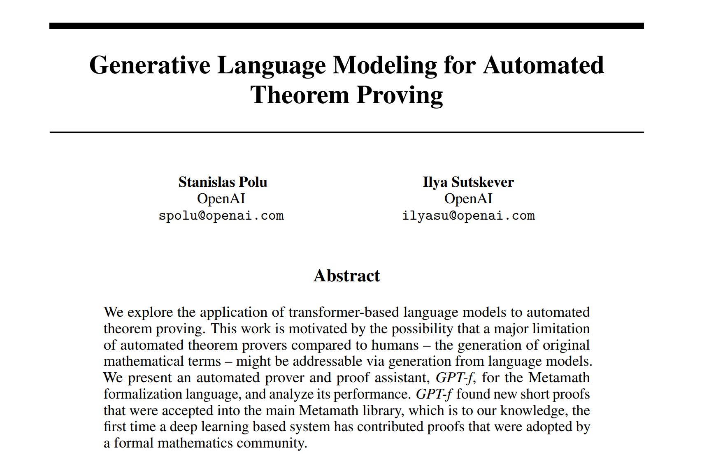
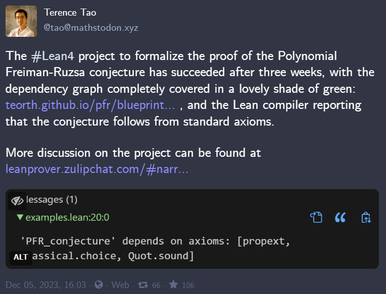
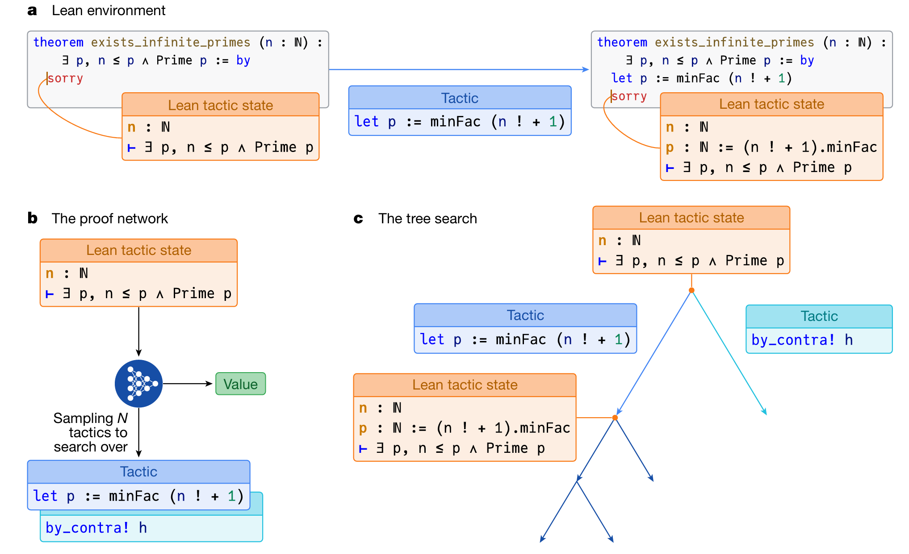
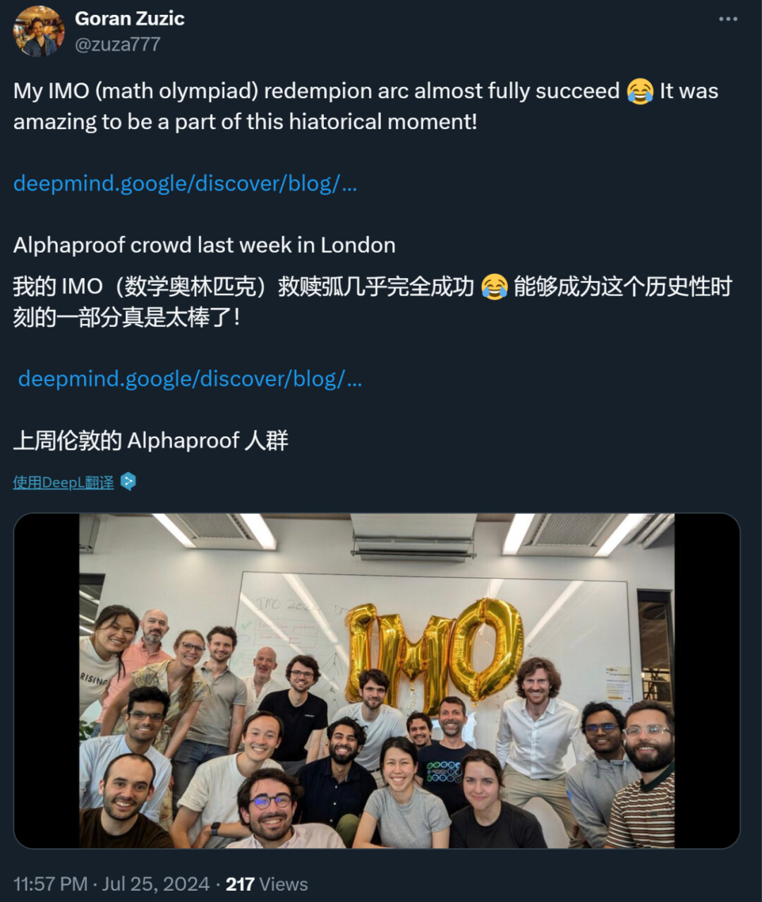
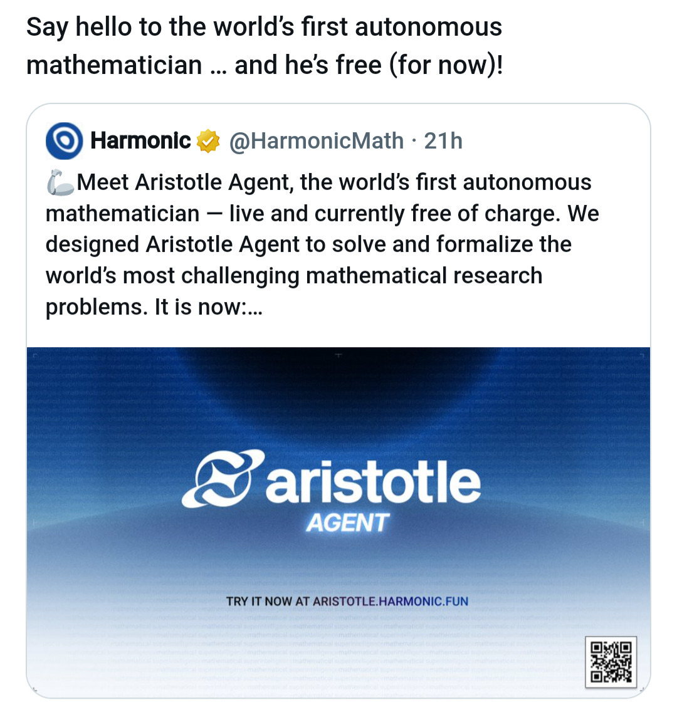

# Lean4的前世今生：一把解锁 LLM 深层推理能力的钥匙
## 引言

2025 年 12 月，一则新闻在 AI 与数学圈同时掀起波澜。24 岁的斯坦福天才少女洪乐潼创立的初创公司 Axiom，在“零产品、零业务”的阶段，仅凭一份愿景便斩获了 3 亿美元的惊人估值[1]。更令人瞩目的是，被誉为“最懂拉马努金的当代数论学者” Ken Ono 也宣布加入这家年轻的公司。

支撑起这个梦幻开局的，是他们打出的极具野心的旗号：**AI for Math**。

更准确地说，是借助形式化编程语言，让 AI 像顶尖数学家一样，不仅能输出灵感，更能构建出严丝合缝、可被编译器绝对验证的**形式化证明（Formal Proofs）**。Axiom 描绘的终局远不止于解数学题——他们希望未来 AI 写出的关键代码和核心推理，都能在数学层面上被“自证清白”：确保函数穷尽所有边界条件，确保逻辑不引发内存泄漏，确保整个系统从根源上免疫特定类型的安全漏洞。


<center>Axiom团队合影，洪乐潼居中</center>

在迈向通用人工智能（AGI）的征途中，高阶数学推理与复杂逻辑验证，始终是学术界与工业界仰望的“王冠明珠”。然而，大语言模型（LLM）基于概率预测与自回归生成的本质，决定了它们在面对需要绝对严谨的长逻辑链时，往往会不可避免地滑向“幻觉”。要打破这一瓶颈，单靠堆砌算力或增加语料已力不从心。

> **形式化编程语言与大模型的深度融合，正成为打破这堵叹息之墙的破局点。**

在众多形式化验证生态中，**Lean 4** 的崛起显得尤为耀眼。它构筑了一座连接“人类模糊数学直觉”与“机器绝对严密性”的桥梁，正在暗中蓄力，试图掀起一场横跨数学发现、自动定理证明与高安全软件开发的范式革命。

相比目前在风暴中心的“智能体编程（Agentic Coding）”，整个业界对 Lean 4 的感知或许还停留在水面之下。但种种技术暗流表明，我们正处于一场巨大技术风暴的前夜。因此，本文想撕开这层略带学术高冷的面纱，聊聊 Lean 4 的前世今生，试图用技术人最熟悉的语言和视角，带大家认识这项或许会重塑未来编程形态的技术。

---

## 本文大纲

1. **混沌初开：Lean 的概念起源与语言进化 (2013 - 2021)**
* 从微软研究院实验室走出的“新物种”
* 为什么主流编程语言证明不了数学定理？


2. **重构：从 Lean 3 到 Lean 4 的底层跃迁 (2023)**
* **破釜沉舟**：为什么一定要彻底重构？
* **Mathlib 4 的大迁徙**：人类数学知识库的“数字化重铸”


3. **逻辑与概率的交汇：Lean 4 正在成为解锁 LLM 深层推理能力的钥匙 (2020 - 2025)**
* **生成式AI与形式化编程的早期结合**：从Metamath的1%到Lean的30%（2020 - 2022）
* **范式革命**：拥抱大语言模型的浪潮 (2023 - 2024)
* **The Bitter Lesson 的数学回响**：AlphaProof与 Lean 4 铺就的无限之路 (2024.07)
* **迈入Agent时代**：硅基数学家初具雏形 (2025 - 2026)


4. **价值外溢：从“解答数学题”到“构建高可靠软件”**
* **理论基石**：Curry-Howard 同构在软件开发中的现实意义
* **理论落地**：用一个“越界” Bug 读懂“代码即证明”
* **护航关键基础设施**：形式化验证在底层沙盒、容器调度与加密算法中的落地潜力


5. **结语：下一场计算革命的倒计时**


## 1. 混沌初开：Lean 的概念起源与语言进化 (2013 - 2021)

到底什么是形式化编程语言？它和我们日常使用的传统编程语言（如 Python、C++）有什么本质区别？

要想回答这两个问题，我们需要将时钟拨回数十年前，去寻找 Lean 诞生的技术基因。

### 从实验室里走出的“新物种”

早在 1950 年代，RAND 公司的三位学者 Allen Newell、Herbert Simon 和 Cliff Shaw 就在思考一个极其宏大的问题：**能否将罗素与怀特海的《数学原理》用计算机程序来实现？** 毕竟，书里的数学命题严丝合缝、规则清晰、每一步都能被严格校验，这天生就适合让计算机来处理。

于是，在 1955 年底到 1956 年初，世界上第一个自动定理证明器（Automated Theorem Prover, ATP）——**Logic Theorist** 诞生了，并在此后著名的达特茅斯会议上大放异彩。它确立了一个影响至今的核心思想：**数学推理是可以被拆解为符号、规则与搜索，并由程序来严格验证的。** 在后来漫长的历史长河中，这一思想被不断传承，从 de Bruijn 的 Automath 项目，到 LCF 系统、Coq，最终演进到了今天现代形式化验证的基石——带有归纳类型的构造演算（Calculus of Inductive Constructions, CIC）架构。


<center>从左到右分别是Allen Newell、Herbert Simon 和 Cliff Shaw</center>


时间来到 2013 年，微软研究院的计算机科学家 Leonardo de Moura 决定发起 Lean 项目。当时的形式化领域面临着一个巨大的痛点：“自动定理证明”（高度自动化但像个黑盒）与“交互式定理证明”（极其严谨但需要大量纯手工编写）之间是两样几乎独立的存在；而且当时的学者在编写自定义证明策略时，往往需要痛苦地在多种编程语言（如 Coq 和 OCaml）之间反复横跳。

Leonardo 的愿景很纯粹：**将自动化与交互式证明统一起来，并实现“用 Lean 开发 Lean”。** 这一动机直接催生了如今的 Lean 4——它不仅是一个 ITP，更是一门纯函数式、能够直接编译到 C、且具备极高运行效率的通用编程语言。

伴随着 2014 年 Lean 0.1 版本的问世，这个项目开始在探索中持续进化。2017 年 1 月发布的 Lean 3 迎来了历史性的拐点：它将 Lean 从单纯的逻辑规范语言，正式升级为元编程语言。用户首次能够用 Lean 语言本身来编写自动化证明策略（Tactic）。这可扩展性点燃了整个学术界的热情，催生了庞大的数学基础库 **Mathlib**。至此，Lean 从微软的一个小团队实验项目，正式蜕变为由全球数学家共同繁荣的庞大生态。


<center>左边是Nikolaj Bjørner、中间是Leonardo de Moura，19年因在自动化推理方面的贡献而获奖</center>


### 为什么主流编程语言证明不了数学定理？

了解完历史，很多读者可能对“形式化编程”依然缺乏直观的感受。它到底跟我们平时写的 Python 有什么不同？为什么 Python 不能用来证明数学定理？

**注意，“形式化编程语言是一个统称，而Lean 4变成语言是其中的代表**，为了更好地了解形式化编程，我们用一个直观地例子来展现。

用一句简单的话概括：在Lean4编程语言中，当你写下一段代码，就是写下一段证明逻辑，**只要代码编译通过，就说明该证明100%正确**。

让我们来看一个所有人都能一眼看懂的简单数学定理：“0 加任何自然数都等于它自身”。用数学符号表示就是：

$$\forall n, 0 + n = n$$

如果你用 **Python** 来“证明”这个定理，你大概只能这么写：

```python
def zero_add(n):
    # 只能检查运行时具体的数值
    assert 0 + n == n   

# 尝试测试 1000 个例子
for i in range(1000):
    zero_add(i)         

```

看出问题了吗？Python 只能基于枚举进行**运行时检查**。哪怕你循环了一万次、一亿次，你也只是“测试”了这部分数据，永远无法在逻辑上覆盖“所有的自然数 $n$”。一旦底层代码被修改，这个性质只能靠重新跑一遍测试用例来祈祷它没坏。**测试永远不能代替严谨的数学证明。**

而数学家会怎么做？为了覆盖无限的自然数，我们需要使用**数学归纳法**：首先证明 $n = 0$ 的情况，然后假设 $n$ 成立，去证明 $n + 1$（即它的后继数）也成立。

在 **Lean 4** 中，我们可以完美地将这种数学思维转化为程序：

```lean
-- 定理：对所有自然数 n，0 + n = n
theorem zero_add (n : Nat) : 0 + n = n := by
  induction n with
  | zero =>
      -- 基础情况：目标变成 0 + 0 = 0。等式两边在定义上完全相同，直接使用 rfl (reflexivity) 证明。
      rfl
  | succ n ih =>
      -- 归纳步骤：目标是 0 + (succ n) = succ n
      -- 此时我们拥有归纳假设 (ih) : 0 + n = n
      -- 使用 rw (rewrite) 策略，将目标里的 0 + n 替换为 n，目标就变成了 succ n = succ n
      rw [ih]
      -- 两边再次完全相同，证明结束。
      rfl

```

**这段代码的底层到底发生了什么？**

在 Lean 4 里，$0 + n = n$ 是一个**类型（Type）**。这个类型依赖于变量 $n$ 的值，这就是所谓的“依赖类型”（Dependent Type）。

当你写下 `theorem zero_add (n : Nat) : 0 + n = n` 时，你实际上是在声明一个函数：这个函数接收任意一个自然数 $n$，并要求你返回一个类型为 `$0 + n = n$` 的实例对象。而代码块中的 `induction`、`rw`、`rfl` 这些被称为“策略（Tactic）”的指令，在底层会被 Lean 的编译器编译成一个普通的函数程序。

**总结来说：** 传统语言的编译器只检查你代码的运行逻辑对不对；而 Lean 4 允许你给函数写一个“绝对不会出错的数学规格”，并且这个规格本身就是“类型”。Lean 的编译器会死死地盯着你，强制你一步步构造出符合该规格的程序。**这个敲代码构造程序的过程，就是数学证明。**


<center>一张图对比python（左）和Lean（右）的区别</center>

## 2. 重构：从 Lean 3 到 Lean 4 的底层跃迁 (2023)

正如上文所述，2017 年发布的 Lean 3 已经是一个高度可用的版本，并在随后的数年里成为了全球数学家共建的硬核游乐场，**Mathlib** 也由此诞生。**Mathlib**是什么？

如果你熟悉 Python，你可以将 Mathlib 粗略地理解为 Lean 语言的 `pip` 第三方依赖库。只不过，这个库里装的不是函数代码，而是人类经过编译器绝对检验的**现代数学知识结晶**（定义、定理和证明）。Lean 语言本身的内核极其精简，但 Mathlib 就像地基上的砖瓦，支撑起了极其庞大的证明体系。

数学定理的证明从来不是孤立的。当你要证明一个前沿的数论命题时，你可能需要同时调用群论、环论、拓扑学、实分析、组合数学甚至范畴论里的几百个旧结论。如果没有 Mathlib 这个极其丰富的“弹药库”，**你每走一步都要从最基础的公理（如 $1+1=2$）开始推导，根本走不到现代数学的深水区。**

### 破釜沉舟：为什么一定要彻底重构Lean 3？

尽管 Lean 3 取得了巨大的生态成功，但它依然面临着一个致命的架构瓶颈：**语言的割裂**。

Lean 3 的底层大部分是用 C++ 编写的。这意味着，如果一位数学家在使用过程中发现缺少某种自动化推导工具，想要扩展编译器的能力，他不仅需要精通数学，还得去修改晦涩的 C++ 源码并重新编译整个系统。这种高昂的扩展成本，极大地限制了社区的创造力。

于是，从 2018 年开始，Leonardo 团队做出了一个极其大胆甚至可以说是“疯狂”的决定：**推翻重来，秘密研发 Lean 4.0**。

在 Lean 4 中，除了一个微小的信任内核和基础运行时使用 C/C++ 编写外，**整个 Lean 编译器、语法解析器和核心库，完全使用 Lean 4 语言自身构建。** 这就是所谓的**系统自举（Bootstrapping）**。直到 2023 年，官方才正式发布了稳定版本的 Lean 4.0.0。此时的 Lean，已经不仅是一个定理证明器，更蜕变成了一门拥有**强大宏系统**、**可以编写底层网络服务和并发调度系统的高性能通用编程语言**。这也为未来Lean 4被用于“可靠软件编程”埋下了伏笔。

### 重构的影响：Mathlib4 的大迁徙

随着 Lean 4 的发布，整个开源数学社区面临着一场生死攸关的工程危机：Lean 3 时代积累的包含数十万条数学定理、超过一百万行代码的 Mathlib 库，由于底层语法的剧变，无法在新编译器上运行。这意味着，全球数百位顶尖数学家过去几年的心血，面临着付之东流的风险。

为了跨越这一鸿沟，Lean 社区发起了一场气势磅礴的代码移植工程。这不是简单的“复制粘贴”。由于数学定理在代码结构上是一个极其庞大且嵌套极深的**有向无环图（DAG）**，底层拓扑学的一个微小定义改变，都可能导致顶层代数几何的数千个证明全部崩溃。

为了在这场百万行代码的重构中保持秩序，社区开发了半自动翻译工具 `mathport` 来协助语法转换，并实施了极其严酷的“渐进式锁定”（Progressive Locking）并行开发策略：一旦依赖树中的某个基础文件被成功验证并人工修复移植到了 Mathlib4，Lean 3 的旧代码库中对应的文件就会立刻进入“只读锁定”状态。任何试图在旧版中对其进行的修改提交（PR），都必须强制伴随一个等价的 Mathlib4 提交。这在海量并发的社区协作中，以近乎严苛的纪律保证了两端数据状态的绝对同步。

经过漫长且艰苦的攻坚，2023 年 7 月 16 日，涵盖了拓扑学、代数几何、测度论等深层数学分支的 Mathlib 大迁徙宣告全面完成，涉及超过 3112 个核心文件。


## 3. 逻辑与概率的交汇：Lean 4 正在成为解锁 LLM 深层推理能力的钥匙 (2020 - 2025)

LLM 本质上是概率模型，长于发散、联想与直觉，却也因此带有天然的不可靠性；而形式化推理恰恰相反，它代表着绝对的严密与收敛，却也因规则过于繁琐而常让研究者感到望而却步。**这两者的结合，恰如给狂奔的野马套上了缰绳——形式化引擎为 LLM 提供了无差错的探索边界，而 LLM 强大的代码生成能力，又刚好化解了形式化编程的繁琐。尽管这一领域的基建仍在完善，但两者之间产生的奇妙化学反应，正悄然成为解锁 AI 深层推理能力的钥匙。**

### 生成式 AI 与形式化编程的早期结合：从Metamath的1%到Lean的30%（2020 - 2022）
早在 2020 年——那还是 LLM 彻底破圈、ChatGPT 尚未问世的“前夜”，OpenAI 的前沿研究员 Stanislas Polu 和 Ilya Sutskever（没错！！就是大名鼎鼎的OpenAI前掌门人）就已经将目光盯向了“形式化定理证明”，**他们想探索生成式AI在形式化数学上的可能性。**

在当年发表的奠基性论文中，他们提出了著名的 GPT-f 模型[2]（一个参数量约 774M 的类似 GPT-2/3 架构模型）。这是历史上第一次尝试使用生成式语言模型来做数学证明。但值得注意的是，GPT-f 最初选择的试验场并非 Lean，而是一个更古老、极度贴近机器底层的形式化系统——Metamath。

尽管 GPT-f 在 Metamath 上成功找到了一些连人类都未曾发现的简短定理，但研究团队很快发现：Metamath 过于底层，根本无法优雅地表达复杂的现代高阶数学。与此同时，伴随着 Lean 语言的快速崛起，大量的现代数学理论开始在 Lean 系统中实现形式化。与 Metamath 相比，Lean 拥有大量强大的策略（Tactic）来辅助推导，这使得通常的 Lean 证明要比 Metamath 简短且抽象得多。



为了提供一个客观的评估标准，2021 年，OpenAI 牵头发布了 MiniF2F 测试集[3]。这是一个由 AMC、AIME 等高中及研究生竞赛题目组成的跨系统基准（Benchmark），旨在为当时不同的“AI 证明器”、不同的“形式化系统”提供一个统一的角斗场。

测试结果令人深思：当研究员将基于 Metamath 训练的 GPT-f 应用于 MiniF2F 时，通过率仅有 1%。然而，当模型切换到使用 Lean 及其 Mathlib 库进行训练时，正确率飙升至接近 30%！在训练算力相当的情况下，Lean 展现出了绝对的优势。这主要得益于模型在 Lean 中能够调用高级策略（High-level Tactics），大模型不再需要去预测底层的符号挪动，而是学会了以更高维、更抽象的方式引导编译器的自动化推理。这次早期的尝试，首次向世人揭示了 Lean 语言的高阶抽象能力与 LLM 结合所产生的巨大潜能。

但在当时，海量预训练和领域微调尚未成为行业共识。AI 要想真正在 Lean 的严密规则下大展拳脚，依然横亘着两座大山：一是缺乏大量且高质量的对齐数据；二是缺乏一个能让 AI 与编译器进行高效、结构化交互的标准环境

### 范式革命：拥抱大语言模型的浪潮（2023-2024）

2022 年底 ChatGPT 的问世，不仅在全球掀起了生成式 AI 的狂潮，也从根本上改写了自然语言处理（NLP）的底层游戏规则。一夜之间，过去那种“针对特定任务、小作坊式精雕细琢算法与数据集”的传统范式，在海量语料与超大参数带来的“涌现能力”面前，显得相形见绌。吸收了互联网级海量数据的 LLM 证明了一点：一个训练极其优良的**基础大模型（Foundation Model）**，无需针对特定下游任务进行魔改，就能在各类语言甚至逻辑任务上展现出统一的泛化潜力。

然而在当时，复杂的数学推理与绝对严谨的形式化证明，依然是 LLM 尚未攻克的堡垒。并且，这类能力的秘密大多只掌握在少数头部科技巨头内部——例如当时在数学推理上表现最顶尖的模型 Google Minerva，是处于完全闭源状态的。于是，学界与业界开始联手，基于彼时主流的开源模型 Llama 2，尝试打造一个在数学推理、计算工具调用和形式化定理证明上均具有顶尖能力的基础模型。这就是 **Llemma**[4]。团队构建并开源了 **Proof-Pile-2** 数据集，这是一个由科学论文（arXiv）、数学网页（OpenWebMath 等）以及数学与形式化语言代码构成的丰富混合语料库；并在此基础上对 Code Llama 进行了 200B tokens 的持续预训练，将其对代码的理解能力泛化到数学与逻辑领域。

这项工作有力地表明：模型无需任何下游微调（*without any further finetuning*），仅通过高质量的领域内预训练，就能解决各类数学问题。Llemma 在当时的 **MATH 基准测试**上超越了所有已知的开源基础模型，同等参数量下甚至优于闭源的 Minerva。具体而言，Llemma 7B 在 MATH 上达到 18.0% 的准确率，在 GSM8K 上达到 36.4%，远超同规模的 Llama 2 与 Code Llama；在形式化任务上，Llemma 使用 Lean 4 在 **MiniF2F 测试集**上取得了 26% 的通过率，展现出良好的性能。

同时期，加州理工学院（Caltech）、德克萨斯大学奥斯汀分校（UT Austin）和 MIT 等机构的研究者们，联手推出了**LeanDojo**框架[5]。研究团队写了一套硬核的底层数据提取脚本，利用 Lean 自身的元编程（Metaprogramming）钩子，解构了编译器运行时的复杂嵌套，它将 Lean 的证明过程完美解构成了“观察状态 $\rightarrow$ 执行策略 $\rightarrow$ 状态转移”的标准控制流。Mathlib 库中深层嵌套的复杂定理变得可检索引擎化（Retrieval），所以团队顺势推出了ReProver（Retrieval-Augmented Theorem Prover）。这可以看作是数学定理召回的初次尝试，为即将到来的Agent时做了铺垫。

2023 年时，Lean 4 虽已初露锋芒，但在形式化生态中，它还不是毫无争议的唯一解。直到后来，随着越来越多现象级的工作不约而同地将技术栈锁定在 Lean 4 上，学界和业界才逐渐达成共识。这种共识的形成离不开国内外顶尖团队的推动。例如在 2024 年 5 月，DeepSeek 团队开源了第一个基于 Lean 4 进行专项强化学习迭代的模型 **DeepSeek-Prover**[6]，通过自行构建大量Lean 4语料，大幅拔高了开源形式化证明的上限。再后来，2025 年初 **DeepSeek-R1** 以其卓越的推理能力震惊世人，也顺势将极高的行业曝光度引向了他们一直在默默耕耘的 Prover 系列工作。

2024 年，著名数学家陶哲轩带领团队借助 LLM 与 Lean 4 交互，成功完成了**多项式 Freiman–Ruzsa 猜想**的完整形式化证明[7]，标志着这一技术组合正式介入严肃的数学研究。自此，Lean 4 彻底蜕变。它不再仅仅是少数极客或数学家用来事后校验定理的“刻板工具”，而是演变成了一种**借由大模型的快速试错、强化搜索以及算力扩展（Scaling），来实质性推进前沿数学研究的基础设施**。




### “The Bitter Lesson”的数学回响：AlphaProof 与 Lean 4 铺就的无限之路 (2024.07)

2024 年 7 月的第 65 届国际数学奥林匹克竞赛（IMO）注定载入史册。**AlphaProof** [8]与专攻几何的 **AlphaGeometry 2** 系统联手，成功斩获 6 道赛题中的 4 道，以 28 分的优异成绩摘得银牌（距金牌线仅一步之遥）。这是人工智能首次在代表人类顶尖智力角逐的数学竞赛中，达到奖牌级别的卓越表现。

这一突破在业界引发了巨大轰动。正如 DeepMind 昔日推出的 AlphaGo 与 AlphaFold 曾相继跨越人类智力的天堑一样，AlphaProof 同样成为了一个划时代的节点。然而，在这场璀璨的胜利背后，鲜为人知的是：正是 **Lean 4** 这一底层形式化系统的支撑，才使得这一壮举成为现实。

彼时，大型语言模型在自然语言处理领域已是所向披靡，但在面对需要多步复杂推演与绝对严谨性的数学证明时，仍难以摆脱“逻辑幻觉”的泥沼。为此，Google DeepMind 团队另辟蹊径，将类似 AlphaZero 的强大强化学习机制，应用到拥有“绝对真理”规则的形式化数学环境中。其核心机制：
* 首先，利用微调后的大模型将自然语言题目自动形式化（Auto-formalization）为 Lean 4 的严格陈述。
* 随后，在搭载底层定理验证器的沙盒环境中，AlphaProof 化身为智能体（Agent），依靠强化学习在 **Lean 4** 构筑的严密逻辑状态树中穿梭，不断调度 Tactic 搜寻证明路径。

在这里，只要代码编译通过，其生成的证明便拥有了 **100% 的数学正确性保证**。



这个历史性的时刻，其实正悄然印证着 Rich Sutton 在《苦涩的教训》（The Bitter Lesson）[9]中揭示的深刻真理：AI for Math 通往未来的钥匙，必然藏于算力的大规模扩展（Scaling）与强大的搜索能力之中。而 Lean 4，作为一个底层可验证、法则绝对严密的执行环境，为智能体提供了绝对正确的验证反馈。由此彻底解放了AI大规模探索的能力。



### 迈入 Agent 时代：Agentic Proof 多工具协同的初步探索 (2025-2026)

2025年中下旬，随着Claude-Code、OpenClaw相继问世，生成式AI首次引发了人类生产力层面的实质性革命，犹如一个巨大的漩涡，将全球的目光与资本疯狂卷入。在这场风暴的绝对中心，正是Agent（智能体）。彼时，OpenClaw成为史上增长最快的开源项目，一夜之间“养龙虾”的极客文化风靡全球，见证了整个技术社区的狂热。

过去的LLM尽管展现出了极高的智力，但其本质仍是一个被困在对话框里的“大脑”，无法直接对现实世界产生实质影响。然而，当工程师们为LLM打造了精密的调度脚手架（Harness）与Agent Runtime之后，一切发生了质变。在Opus 4.5发布前后，实验室观测到了令人振奋的现象：当LLM被接入标准化的工具与真实环境之后，它逐渐打通了连接现实的“超能力”。它可以自主阅读代码仓库、执行Bash命令、等等。模型能力与工程架构的交互迭代，掀起了一场全新的范式狂飙，“最强模型超越人类专家攻破系统级漏洞”这类极具科幻感的新闻开始层出不穷。

与此同时，形式化数学证明领域也悄然发生着底层逻辑的转向。原本LLM与Lean 4的交互模式非常局限，LLM仅负责单向生成代码，Lean 4仅仅作为被动的验证器。然而，人类数学家在攻克难题时，往往需要打草稿、验算、查阅前人论文、将庞大的猜想分解为多个子问题。既然通用Agent可以通过调用工具链重构代码仓库，那么给LLM接入数学工具来协同论证定理也必然可行。业界逐渐达成共识：通向AI for Math的未来，绝不仅仅是一个孤立的庞大模型，而必须是一个高度协同的Agent系统。

在此背景下，涌现出了一批极其优秀的探索先锋。2025年中，由Harmonic AI开发的Aristotle极早构建了完整验证体系的Agent平台，它会在输出最终答案前将中间步骤转换为Lean 4代码并确保跑通，在IMO 2025期间展现出了金牌级别的实力。同期，字节跳动的Seed-Prover-1.0 [10]也在IMO 2025拿下4道赛题。随后在2025年底至2026年初，Seed-Prover-1.5 [11]完成了架构跃迁，确立了经典的“自然语言提供直觉 -> Sketch Model生成形式化引理 -> Agentic Prover并行证明”的三层协同架构，横扫了PutnamBench中88%的本科级高难度题目。另一家硅谷明星公司Axiom Math则将多智能体协作推向极致，在2025年12月的普特南数学竞赛中耗费海量Token进行状态树搜索，解出了全部12道赛题；2026年初，它更是独立找到了人类未曾证明的猜想（如Fel's Conjecture）的Lean 4证明。随后在2026年3月，美团也发布了完全开源的LongCat-Flash-Prover[12]。



纵观这些里程碑式的工作，目前业界主要分化为两条工程路线：一类如Seed-Prover-1.5、LongCat-Flash-Prover、Axiom，属于经过多阶段强化学习、专门面向Lean 4训练的垂直大模型构建的Agent系统，并搭配了预训练绑定的工具；另一类则是以Numina-Lean-Agent [13]为代表的探索，尝试完全基于通用代码Agent配合标准MCP或独立Skill来完成复杂证明，同样表现出来很高的潜力：成功解出了Putnam 2025的所有题目。

除了模型与调度策略的演进，底层基础设施的建设同样在狂飙突进，而以APE-Bench [14]为代表的基建工作补齐了这块至关重要的拼图。DeepSeek-Prover的核心作者辛华剑，以字节研究院学者的身份在2026年1月推出了这一平台。他敏锐地察觉到，形式化数学不应只是孤立的做题，APE-Bench旨在提供一个类似于SWE-Bench的统一环境，让所有的Agent能够系统性地学习Mathlib过往的提交记录与代码合并逻辑。**它的愿景是让Agent像人类数学社区的贡献者一样，一砖一瓦地增添Mathlib的地基。试想一下，如果未来Agent每一次成功求证的定理，都能被自动化地汇入Mathlib 4的庞大图谱中，这场数学革命必将如滚雪球般积累出惊人的势能，最终引发一场颠覆人类认知边界的“雪崩”。**


## 4. 价值外溢：从"解答数学题"到"构建高可靠软件"
在我们最开始的地方提到，硅谷新锐Axiom的愿景不光是创作“硅基数学家”，而且是“零Bug软件的自动化构建”。当 AI 能够以 100% 的正确率解出 IMO 压轴题时，**硅谷野心家们的目光早已越过了纯粹的数学探索，而是投向了一个更具商业和安全价值的蓝海：零 Bug 软件的自动化构建。**

### 理论基石：Curry-Howard 同构在软件开发中的现实意义
长久以来，数学定理的证明与软件工程的代码开发，似乎是两条平行的轨道。那为什么用于数学证明的Lean 4编程系统，可以被用于软件开发？这似乎是风马牛不相及的两头。要理解这种跨界降维打击的逻辑，必须回到计算机科学的一块奠基石——Curry-Howard 同构（Curry-Howard Isomorphism）。

Lean4的底层逻辑是“证明即程序，命题即类型”；这一理论指出，计算机程序与数学证明在底层结构上是完全等价的。在 Lean 4 中，写下一个数学定理，等同于定义了一个复杂的“数据类型”；而完成这个定理的证明，等同于编写了一段能返回该类型数据的“程序代码”。这意味着，如果一个 Agent 能够利用 Lean 4 证明极其复杂的数学猜想，那么在理论上，它同样可以“证明”一段排序算法、一个加密函数或一个调度系统是绝对正确、符合预期的。业界和学界已经有人开始了这种尝试，一个领域的推动往往是从构建Benchmark开始的：论文《Verina: Benchmarking Verifiable Code Generation》[15]（可验证代码生成竞技场），包含 189 个在 Lean 中手工整理的编码任务，配有详细的问题描述、参考实现、形式化规范以及丰富的测试集。论文测试中的最佳模型 OpenAI o3，代码正确率为 72.6%，规范的正确性与完整性为 52.3%，而证明成功率仅为 4.9%。这一测试结果说明，当前模型尽管已经擅长写代码，但是在将代码逻辑映射到形式化语言上还有所欠缺。


### 理论落地：用一个“越界” Bug 读懂“代码即证明”

了解了 Lean 4 是如何严格证明数学定理后，很多读者的疑问可能随之而来：**Lean 4不是数学证明语言吗？这和现实世界的软件工程有什么关系？**

让我们回到上一节的核心哲学：“命题即类型，证明即程序”。在纯数学里，我们在证明 $0 + n = n$；而在真实的工程环境里，我们在证明的，是**代码永远不会触发致命错误**。我们来看一个所有程序员都踩过坑的经典场景：**数组越界（Out-of-Bounds，对应安全漏洞 CWE-125）**。

假设一位新手接到需求：编写一个函数，计算一个数组前 $n$ 个元素的和。他用 Python 写出了如下代码：

```python
def sum_first_n(arr, n):
    total = 0
    # 新手的 off-by-one 错误：错把边界写成了 n+1
    for i in range(n + 1): 
        total += arr[i]
    return total

```

在提交代码前，他编写了一个单元测试：传入数组 `[10, 20, 30, 40]`，并求前 `2` 个元素的和。循环变量 $i$ 依次取 0, 1, 2，分别累加了 10, 20, 30，程序完美运行，测试通过，代码顺利合并上线。直到某天，另一项业务调用了这个函数，传入了 `[10, 20]` 和 `n = 2`。当 $i$ 循环到 2 时，直接触发了 `IndexError`，导致线上服务瞬间崩溃。

**这就是传统软件工程的死穴：单元测试只能证明“在你测过的那几条路里没有 Bug”，却永远无法证明“这间屋子里绝对没有虫子”。**

如果我们把这段完全相同的逻辑，直接翻译成 Lean 4 代码，会发生什么？

```lean4
def sumFirstN (arr : Array Nat) (n : Nat) : Nat := Id.run do
  let mut total := 0
  -- 对应 Python 中的 range(n + 1)，即 [0, n] 闭区间
  for i in [0:n+1] do
    total := total + arr[i]
  return total
```

当你把这段代码敲进编辑器，连编译的资格都没有，Lean 4 会在 `arr[i]` 处直接抛出如下极其严厉的错误提示：

```Bash
failed to prove index is valid, possible solutions:
  - Use `have`-expressions to prove the index is valid
  - Use `a[i]!` notation instead, runtime check is performed, and 'Panic' error message is produced if index is not valid
  - Use `a[i]?` notation instead, result is an `Option` type
  - Use `a[i]'h` notation instead, where `h` is a proof that index is valid
arr : Array ℕ
n : ℕ
total✝ : ℕ := 0
i r✝ : ℕ
total : ℕ := r✝
⊢ i < arr.size
```

**这段报错的底层到底发生了什么？**

在 Python 里，`arr[i]` 仅仅是一个普通的内存读取指令。但在 Lean 4 的世界观里，**数组索引操作的底层签名，是一个必须被证明的数学命题**。当 Lean 4 的编译器扫描到 `arr[i]` 时，它停了下来。它看着错误提示的最后一行 `⊢ i < arr.size`（在形式化语言中，`⊢` 符号代表当前需要证明的数学目标）。编译器在质问你：

> *“你想让我去取第 $i$ 个元素？可以。但你必须先给我提供一个严密的数学证明，证明 $i$ 严格小于数组的长度 `arr.size`。”*

编译器环顾当前的代码上下文（Context）：

1. 它知道 $i$ 来源于 `[0:n+1]`，所以它推导出 $i \le n$。
2. 但是，函数的入参仅仅是 `arr` 和 `n`，没有任何数学约束表明 $n$ 和 `arr.size` 之间存在什么关系。
3. 既然无法在逻辑上必然推导出 $i < arr.size$，编译器拒绝相信这段代码是安全的，直接中断编译。

在传统的开发流程里，Bug 潜伏在暗处，像一颗定时炸弹等待着某个极其罕见的运行时（Runtime）条件来引爆；而在 Lean 4 中，因为“代码即逻辑定理”，任何潜在的越界、空指针、并发死锁，在编译期（Compile-time）就会因为“无法完成安全性证明”而被死死拦在门外。为了让这段代码编译通过，你要么修改函数的入参契约（要求调用者附带传入一个 $n < arr.size$ 的证明），要么在内部老老实实写好安全的边界 `if` 检查。